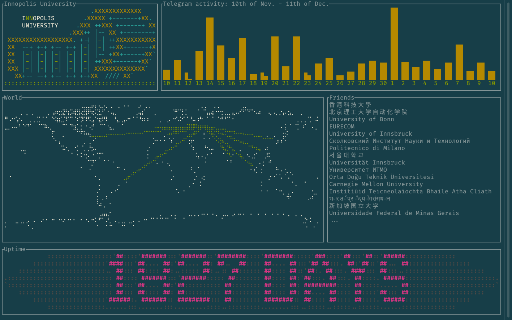

# Happy birthday, Innopolis University! 🎉

long time ago, when Innopolis University has celebrated its fifth birthday, i made this interactive postcard with my [friend](https://github.com/eadventurous), using terminal user interface and some real-world data.  it is written in rust programming language with [`tui`](https://crates.io/crates/tui) + [`termion`](https://crates.io/crates/termion) crates.  list of "friendly" universities was data-mined by hands, telegram activity data was gathered from [@combot](https://combot.org/) stats of "Super Innopolis" city-wide telegram group chat.  everything else is colorized static data.

also, posted on [instagram](https://www.instagram.com/p/BckIVTMDgHq/).
